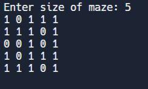
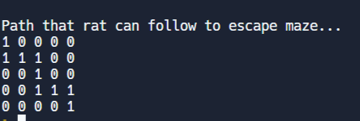

# Rat in Maze

## About Problem

- We are given a matrix of 0s and 1s where 0 represent walls and 1 represent path where mouse can travel
- We have to find correct path to escape from the maze [ Mouse can move only forwards or downwards]

<table>
    <th>INPUT</th>
    <th>OUTPUT</th>
    <tr>
        <td>
            
        </td>
        <td>
            
        </td>

    </tr>
</table>